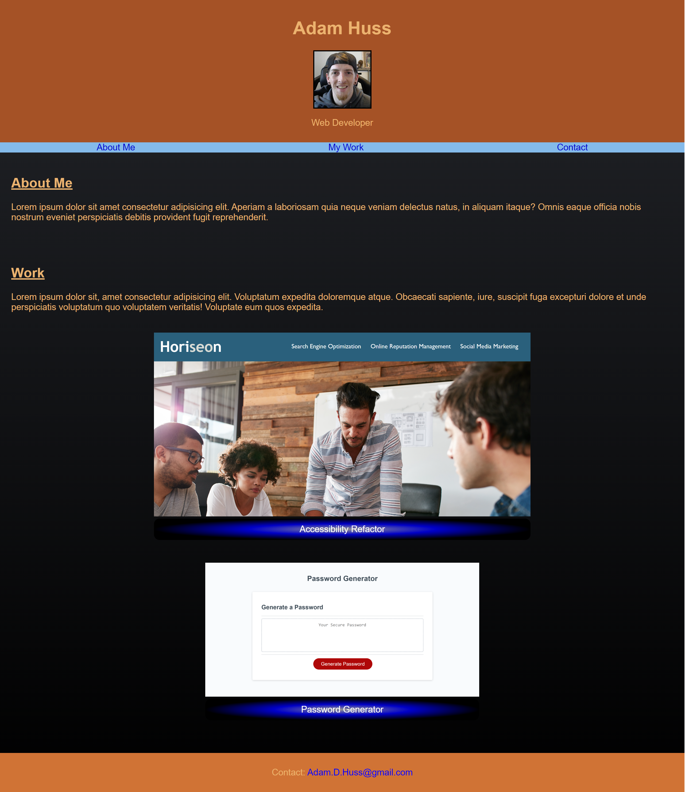

# Portfolio Page

## Description

The purpose of this website was to create a portfolio page to display my web development work and to practice HTML and CSS.

I learned how to add a favicon to my page tab, control image sizes, add radial gradient to elements, dynamically change element sizes and positioning with screen sizes, make images into links, and to remove the default text decorations for links.

## Usage

---

## Credits

Thank you to i0nah at https://www.deviantart.com/i0nah/gallery?page=2 for the favicon image and Stack Overflow for how to add it to my page.

## License

MIT License